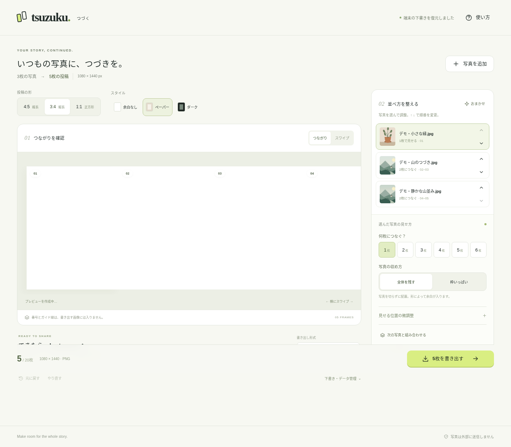

# つづく / tsuzuku

**写真を選ぶ → おまかせで配置 → 少し調整 → 保存 → Instagramアプリで投稿。**

横長写真を複数ページにつなぎ、写真を組み合わせてカルーセル画像を作るWebアプリです。静的ファイルだけで動き、アプリのログイン、写真のサーバー送信、端末間の自動同期はありません。

これは仕様だけの雛形ではありません。編集画面、画像処理、連番書き出し、ローカル下書き、テスト、GitHub Pages用ワークフローを含む実装です。2026年9月6日に [GitHub Pages](https://studioap.github.io/tsuzuku-studio/) へ公開し、本番URLで自動ブラウザテストを完了しました。ただし、**実機iPhoneでのHEIC取り込み・共有メニュー・写真アプリへの保存・Instagram投稿は未確認**です。



## Macで開く

Node.js 22.12以上が入っているMacで、このフォルダに移動して実行します。

```bash
npm run dev
```

ブラウザで `http://localhost:5173` を開きます。「まずはデモで試す」で、写真を用意せずに使えます。`index.html` のダブルクリックではなく、この起動方法を使ってください。

起動環境はHTTPS、または開発用のlocalhostを対象にしています。iPhoneからMacのHTTPローカルIPへアクセスする方法はサポート対象外です。

通常の起動・テスト・ビルドには、`npm install`、APIキー、環境変数は不要です。Node自体が未導入の場合は、まずMac側でNodeをセットアップしてください。`.nvmrc` は22系です。

## 今できること

| 操作 | 内容 |
|---|---|
| 自動配置 | 写真の縦横比から、横長を2枚以上、縦長を1枚に配置。選ばれた順番を維持します。 |
| 元写真の前処理 | 元ファイルを変えずに、0.1度単位の傾き補正、上下左右のトリミング、中央の正方形化。回転時は白場が出ない最小倍率へ自動調整。 |
| 横長写真をつなぐ | 1写真を1〜6枚に分割。ページの内部境界に余白を加えません。 |
| 簡単な修正 | 順番、分割数、全体表示／枠いっぱい、拡大と位置、背景を変更。元に戻す・やり直しも対応。 |
| 写真の組み合わせ | 隣の写真と一組にし、上下／左右に並べる、または重ねる。 |
| 見え方の確認 | 横につながった表示と、1枚ずつのスワイプ表示。 |
| 書き出し | JPEGまたはPNG。幅1080px、4:5 / 3:4 / 1:1。全ページが同じサイズ。01、02…の連番。 |
| iPhoneでの保存 | 利用可能ならファイル共有メニュー。使えなければ1枚ずつ保存・画像を開く。Mac向けZIPも用意。 |
| 下書き | このブラウザに1件自動保存。任意で `.tsuzuku` ファイルに持ち出し・再読み込み。自動同期ではありません。 |
| アプリ風の起動 | manifestとService Workerを同梱。配信後はホーム画面追加と、キャッシュ後のオフライン利用を想定。 |

「おまかせ」は**写真の内容を認識するAIではなく、形を使うルール**です。被写体・顔・色・テーマを推定した自動トリミングはしません。

実際の2枚の出力例は `examples/panorama-2/01.png` と `02.png` に入っています。デモイラストをこのアプリで書き出した画像です。

## 最初に試す設定

横長写真1枚を選び、写真の設定で「2枚」「全体を残す」にしてください。切り抜きを許せるときだけ「枠いっぱい」にします。

同じ投稿へ単体写真を混ぜる場合は、その写真の「元写真を整える」で正方形にするか、「正方形＋上下余白の1枚にする」を使います。投稿の形を4:5にしたまま、正方形写真は中央に置かれ、上下に余白が入ります。前後の横長写真は2枚連結のまま維持できます。

4:5の2枚を合わせると8:5です。元写真の比率が違えば、「全体を残す」には外側の余白が必要です。**全体を残す・余白ゼロ・任意の投稿比率の3つを常に同時に満たすことはできません。**元写真が3:2なら、3:4を2枚つなぐと同じ比率になります。

## 保存から投稿まで

書き出し後に「共有メニューを開く」を押します。端末側に「画像を保存」があれば選択してください。表示されない場合は、1枚ずつの「保存」や「画像を開く」を使います。共有メニューの項目・複数保存の可否はOSとブラウザ次第です。[S3]

最後はInstagramアプリの新規投稿で複数選択し、このアプリの **01 → 02 → 03…** の順に選びます。写真アプリの並び順は信用しすぎず、見た目でも確認してください。投稿時の画像ごとの切り取り・回転は避け、同じ比率にそろえてください。Instagram側の表示・再圧縮はこのアプリでは制御できません。

## 写真の扱いと制約

- 入力は最大20写真、1写真40MBまで。出力は最大20枚、1組の分割は最大6枚です。
- JPEG / PNG / WebPに対応。HEICはブラウザがデコードできる場合だけ対応します。WebKitはSafari 17でHEIC対応を導入していますが、全端末・全HEICファイルの成功を保証するものではありません。[S4]
- 作業用画像は長辺4096px・約8MP以内のJPEGに変換。透明部分は白くし、元のEXIFなどのメタデータは引き継がず、元写真は変更しません。PNG書き出しでも、入力時の作業用JPEG化は行います。元のHDR・広色域特性や透過を維持する用途ではありません。
- 作業用画像以上の拡大は解像度警告を表示します。極端なパノラマや低解像度写真では画質が足りない場合があります。
- 下書きはブラウザの保存領域です。データ削除・容量不足・プライベートブラウズ等で失われる可能性があります。大切な編集は任意の下書きファイルにも保存してください。[S5]
- `.tsuzuku` には作業用写真が含まれます。外部へ共有したりGitに追加したりしないでください。保存先をiCloudなどに選んだ場合、その後の同期は選んだ保存サービス側の動作です。
- 初回アクセスや更新ではアプリ本体をダウンロードします。配信事業者には通常のアクセスログが残る場合があります。「写真を送らない」は「一切の通信がない」という意味ではありません。

Instagramの公式ヘルプで、手動の複数投稿は最大20点、写真は幅1080pxを基準とし3:4までの比率が案内されています。この実装のプリセットと上限はその範囲に合わせています。公式ページの確認日：2026-09-05。[S1][S2]

## 開発・公開

```bash
npm run check
npm test
npm run build
npm run preview
```

公開するのは `dist/` の中身です。GitHub Pages用の `.github/workflows/pages.yml` を同梱しています。詳しい設定は `docs/DEPLOY.md` を参照してください。MacのローカルIPをiPhoneで開くだけでは、共有用の安全なコンテキスト条件を満たさない場合があります。本番確認はHTTPSのURLで行ってください。[S3][S6]

## 引き継ぎ資料

| ファイル | 用途 |
|---|---|
| `START_HERE.md` | Macへ持ち帰った直後の操作 |
| `docs/REQUIREMENTS.md` | 確定した要件と受け入れ条件 |
| `docs/ARCHITECTURE.md` | データ構造・分割計算・保存・設計上の判断 |
| `docs/DEPLOY.md` | GitHub管理とPages公開 |
| `docs/CODEX_HANDOFF.md` | Codexに渡す依頼文と実機確認の優先順位 |
| `AGENTS.md` | コーディングエージェント向けの継続的な制約 |
| `docs/TESTING.md` | テスト実行方法、実施結果と未確認事項 |
| `docs/SOURCES.md` | [S1]〜[S8]の一次資料 |

デモイラストとアイコンはこの実装内で生成したものです。外部写真、外部Webフォント、CDN、計測スクリプトは含みません。アプリ名は仮称で、SCRLやInstagramの公式アプリではありません。
